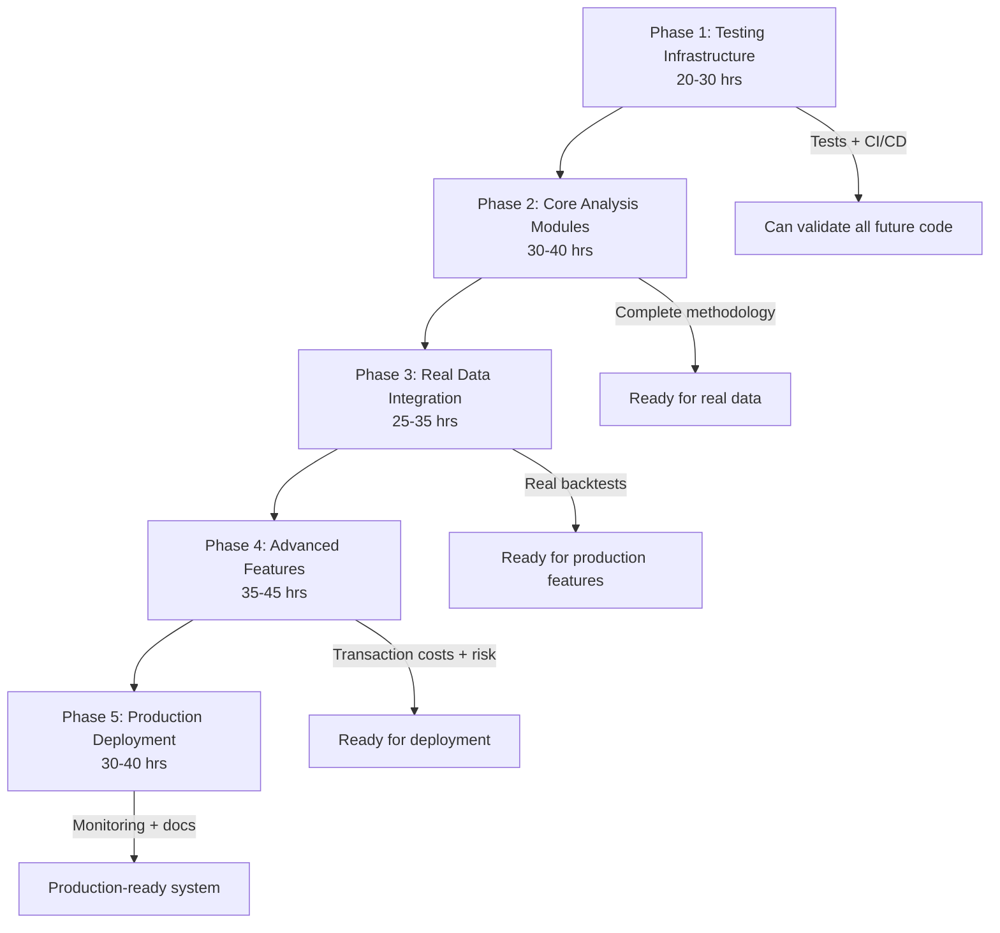

# CODEX Master Directive: ACCT445-Showcase Production Trading System

**Agent**: Codex
**Total Budget**: 200 hours
**Estimated Usage**: 140-190 hours
**Objective**: Transform research prototype → production-ready trading system
**Repository**: `/Users/nirvanchitnis/ACCT445-Showcase`
**GitHub**: https://github.com/nirvanchitnis-cmyk/ACCT445-Showcase

---

## Mission Statement

Build a production-grade quantitative trading system that tests the hypothesis: **"Banks with opaque CECL disclosures (high CNOI) underperform transparent banks in stock returns and have higher risk."**

The system must be:
- ✅ **Reliable**: >80% test coverage, CI/CD pipeline, comprehensive error handling
- ✅ **Validated**: Real market data from yfinance, academic-quality econometrics
- ✅ **Production-Ready**: Transaction costs, risk management, monitoring, deployment infrastructure
- ✅ **Maintainable**: Clean code, comprehensive documentation, modular architecture

---

## Current State (Baseline)

**What Exists**:
- ✅ Clean modular codebase (4 Python modules, 1,155 LOC)
- ✅ Sample data (40 banks, 411 filings)
- ✅ Decile backtest with Newey-West HAC standard errors
- ✅ Event study (SVB collapse methodology)
- ✅ CIK-to-ticker mapping via SEC API
- ✅ Comprehensive README with methodology
- ✅ Basic data loading utilities

**What's Missing**:
- ❌ No test suite (0% coverage)
- ❌ No CI/CD pipeline
- ❌ Panel regression module not implemented
- ❌ Dimension analysis module not implemented
- ❌ Performance metrics module not implemented
- ❌ Only 1 of 5 planned notebooks exists
- ❌ Notebooks use simulated data, not real yfinance
- ❌ No transaction costs, advanced risk metrics, or robustness checks
- ❌ No production deployment infrastructure

**Code Quality**: 8.5/10 (clean, well-documented)
**Production Readiness**: 3/10 (prototype only)

---

## Phase Structure & Dependencies



**Critical Path**: Each phase MUST be completed and validated before starting the next.

---

## Phase Summaries

### Phase 1: Testing Infrastructure (20-30 hours)
**File**: `PHASE1_TESTING_INFRASTRUCTURE.md`
**Status**: 🟡 Ready to Start
**Dependencies**: None (can start immediately)

**Objectives**:
- Build comprehensive test suite (pytest) for all 4 existing modules
- Set up GitHub Actions CI/CD (pytest, black, ruff, coverage reporting)
- Implement data validation framework with schema checks
- Replace all `print()` with structured logging
- Add custom exception classes for better error handling

**Definition of Done**:
- ✅ >80% test coverage across all modules
- ✅ CI/CD pipeline green on GitHub
- ✅ All existing modules have unit tests and integration tests
- ✅ Data validation catches schema violations
- ✅ Logging configured with levels (DEBUG, INFO, WARNING, ERROR)

**Checkpoints** (validate every 8-10 hours):
1. Test suite for `cik_ticker_mapper.py` complete
2. Test suite for `data_loader.py` complete
3. Test suite for `decile_backtest.py` complete
4. Test suite for `event_study.py` complete
5. CI/CD pipeline running successfully

---

### Phase 2: Core Analysis Modules (30-40 hours)
**File**: `PHASE2_CORE_ANALYSIS.md`
**Status**: 🔴 Blocked (requires Phase 1)
**Dependencies**: Phase 1 complete (need test infrastructure)

**Objectives**:
- Implement `src/analysis/panel_regression.py` (Fixed Effects, Fama-MacBeth, Driscoll-Kraay SEs)
- Implement `src/analysis/dimension_analysis.py` (analyze D, G, R, J, T, S, X individually)
- Implement `src/utils/performance_metrics.py` (Sharpe, Sortino, IR, max drawdown, Calmar, etc.)
- Write comprehensive tests for all new modules (>80% coverage)
- Add demo sections to each module

**Definition of Done**:
- ✅ All 3 new modules implemented with proper docstrings
- ✅ Panel regression supports Fixed Effects, Fama-MacBeth, Driscoll-Kraay
- ✅ Dimension analysis tests each CNOI component separately
- ✅ Performance metrics match industry-standard formulas (verify against quantlib)
- ✅ >80% test coverage for all new code
- ✅ CI/CD pipeline stays green

**Checkpoints**:
1. `panel_regression.py` implemented with Fixed Effects
2. `panel_regression.py` implements Fama-MacBeth
3. `dimension_analysis.py` complete
4. `performance_metrics.py` complete with all metrics
5. All tests passing

---

### Phase 3: Real Data Integration (25-35 hours)
**File**: `PHASE3_REAL_DATA_INTEGRATION.md`
**Status**: 🔴 Blocked (requires Phase 2)
**Dependencies**: Phase 2 complete (need all analysis modules)

**Objectives**:
- Create 4 new Jupyter notebooks with real yfinance data:
  - `01_data_exploration.ipynb`: Explore CNOI distributions, correlations
  - `02_decile_analysis.ipynb`: Full decile backtest with real returns
  - `03_event_study.ipynb`: SVB collapse analysis with real data
  - `04_panel_regression.ipynb`: Panel regressions with controls
- Implement robust yfinance integration (rate limiting, retries, error handling)
- Generate real results for all 40 sample banks
- Validate methodology against academic benchmarks
- Document performance (sample 40 vs hypothetical full universe)

**Definition of Done**:
- ✅ All 4 notebooks run end-to-end without errors
- ✅ Real market data fetched successfully from yfinance
- ✅ Results tables generated and saved to `results/`
- ✅ Methodology validation: decile spread significant, event study shows expected pattern
- ✅ Rate limiting prevents API bans
- ✅ Notebooks have markdown explanations for each section

**Checkpoints**:
1. `01_data_exploration.ipynb` complete with visualizations
2. `02_decile_analysis.ipynb` complete with real backtest
3. `03_event_study.ipynb` complete with SVB analysis
4. `04_panel_regression.ipynb` complete with all models
5. All results validated and documented

---

### Phase 4: Advanced Features (35-45 hours)
**File**: `PHASE4_ADVANCED_FEATURES.md`
**Status**: 🔴 Blocked (requires Phase 3)
**Dependencies**: Phase 3 complete (need validated methodology)

**Objectives**:
- Implement transaction cost modeling (bid-ask spread, market impact, bps costs)
- Add advanced risk metrics (VaR, CVaR, tail risk, beta, factor exposures)
- Build robustness check framework (bootstrap, permutation tests, subsamples)
- Set up data versioning with DVC (track CNOI updates)
- Implement configuration management (config.toml for parameters)
- Optimize performance (caching, vectorization, parallelization)
- Add pre-commit hooks for code quality

**Definition of Done**:
- ✅ Transaction costs reduce backtest returns by realistic amount (2-5 bps)
- ✅ Risk metrics calculated correctly (validate against QuantLib/riskfolio)
- ✅ Robustness checks confirm main results hold across subsamples
- ✅ DVC tracking all data files with SHA-256 hashes
- ✅ Configuration file controls all analysis parameters
- ✅ Performance improvements: >50% faster backtests via caching
- ✅ Pre-commit hooks enforce black, ruff, pytest on every commit

**Checkpoints**:
1. Transaction cost module complete
2. Advanced risk metrics implemented
3. Robustness framework complete
4. DVC and config management set up
5. Performance optimization complete

---

### Phase 5: Production Deployment (30-40 hours)
**File**: `PHASE5_PRODUCTION_DEPLOYMENT.md`
**Status**: 🔴 Blocked (requires Phase 4)
**Dependencies**: Phase 4 complete (need all features)

**Objectives**:
- Dockerize the application (Dockerfile, docker-compose.yml)
- Create automated backtest runner (daily/weekly updates)
- Build monitoring dashboard (Streamlit or Dash)
- Implement alerting system (data quality issues, performance degradation)
- Generate Sphinx API documentation
- Write production deployment guide
- Create incident response playbooks
- Add production logging and observability

**Definition of Done**:
- ✅ Docker container builds and runs successfully
- ✅ Automated runner fetches new CNOI data and runs backtests
- ✅ Dashboard displays current portfolio, performance metrics, risk
- ✅ Alerts fire when data quality drops or returns deviate
- ✅ Sphinx docs auto-generated and hosted (GitHub Pages or ReadTheDocs)
- ✅ Deployment guide allows anyone to run the system
- ✅ Incident playbooks cover common failure modes

**Checkpoints**:
1. Dockerization complete
2. Automated runner working
3. Dashboard functional
4. Alerting system tested
5. Documentation published

---

## Critical Success Factors

### 1. Test Coverage (Non-Negotiable)
- Every function must have unit tests
- Integration tests for end-to-end workflows
- Edge cases covered (missing data, API failures, extreme returns)
- CI/CD must be green before proceeding to next phase

### 2. Real Data Validation
- yfinance integration must handle rate limits, retries, stale data
- Results must be compared to academic benchmarks (e.g., Fama-French factors)
- Methodology must match published econometrics papers

### 3. Production Quality
- No hardcoded paths or credentials
- All configuration in config.toml
- Comprehensive error handling
- Logging at appropriate levels
- Documentation for every public function

### 4. Checkpoint Discipline
- Stop and validate every 8-10 hours
- Run full test suite at each checkpoint
- Update TODO list in directive files
- Document any deviations from plan

---

## Working Principles

### Code Quality Standards
```python
# Every module must have:
# 1. Module-level docstring with purpose, references
# 2. Type hints on all function signatures
# 3. Comprehensive docstrings (Args, Returns, Raises, Examples)
# 4. Unit tests in tests/ directory
# 5. Demo section in if __name__ == "__main__"

# Example:
def compute_sharpe_ratio(
    returns: pd.Series,
    risk_free_rate: float = 0.0,
    periods_per_year: int = 252
) -> float:
    """
    Compute annualized Sharpe ratio.

    Args:
        returns: Daily return series
        risk_free_rate: Annual risk-free rate (default: 0.0)
        periods_per_year: Trading days per year (default: 252)

    Returns:
        Annualized Sharpe ratio

    Raises:
        ValueError: If returns is empty

    Example:
        >>> returns = pd.Series([0.01, -0.02, 0.015, 0.005])
        >>> compute_sharpe_ratio(returns)
        0.523
    """
    if len(returns) == 0:
        raise ValueError("Returns series is empty")

    excess = returns - risk_free_rate / periods_per_year
    return np.sqrt(periods_per_year) * excess.mean() / excess.std()
```

### Testing Standards
```python
# Every test must:
# 1. Be in tests/ directory matching src/ structure
# 2. Use descriptive test names (test_sharpe_ratio_with_positive_returns)
# 3. Cover normal cases, edge cases, error cases
# 4. Be deterministic (use fixed random seeds)
# 5. Run quickly (<1 second per test)

# Example:
def test_sharpe_ratio_positive_returns():
    """Test Sharpe ratio with consistently positive returns."""
    returns = pd.Series([0.01, 0.02, 0.015, 0.01])
    sharpe = compute_sharpe_ratio(returns)
    assert sharpe > 0, "Sharpe should be positive for positive returns"
    assert np.isfinite(sharpe), "Sharpe should be finite"

def test_sharpe_ratio_empty_returns_raises():
    """Test that empty returns raises ValueError."""
    with pytest.raises(ValueError, match="empty"):
        compute_sharpe_ratio(pd.Series([]))
```

### Git Commit Standards
```bash
# Every commit must:
# 1. Pass CI/CD pipeline (tests, linting, formatting)
# 2. Have descriptive message following Conventional Commits
# 3. Be atomic (one logical change per commit)
# 4. Include co-authorship tag

# Examples:
git commit -m "feat(testing): add test suite for decile_backtest.py

- Add unit tests for assign_deciles function
- Add integration test for full backtest workflow
- Achieve 85% coverage for module

✅ All tests passing
📊 Coverage: 85%

🤖 Generated with Claude Code
Co-Authored-By: Codex <noreply@anthropic.com>"

git commit -m "feat(analysis): implement panel_regression.py

- Add Fixed Effects regression with entity/time effects
- Implement Fama-MacBeth two-stage procedure
- Add Driscoll-Kraay standard errors for panels
- Include comprehensive docstrings and type hints

✅ Tests: 12/12 passing
📊 Coverage: 87%

🤖 Generated with Claude Code
Co-Authored-By: Codex <noreply@anthropic.com>"
```

---

## Risk Management & Rollback

### Common Failure Modes
1. **API Rate Limits**: yfinance bans IP after too many requests
   - **Mitigation**: Implement exponential backoff, cache results
   - **Rollback**: Use cached data from previous run

2. **Missing Tickers**: Some CIKs don't map to Yahoo tickers
   - **Mitigation**: Log warnings, skip gracefully, report coverage
   - **Rollback**: Use sample data subset with known good tickers

3. **Test Failures**: New code breaks existing tests
   - **Mitigation**: Run full test suite before committing
   - **Rollback**: Git revert to last green commit

4. **Statistical Anomalies**: Results don't match expected patterns
   - **Mitigation**: Add validation checks, compare to benchmarks
   - **Rollback**: Flag for manual review, don't proceed to next phase

### Validation Gates (Cannot Proceed Without)
- ✅ Phase 1 → Phase 2: CI/CD green, >80% coverage
- ✅ Phase 2 → Phase 3: All modules implemented, tests passing
- ✅ Phase 3 → Phase 4: Real data backtests running, results reasonable
- ✅ Phase 4 → Phase 5: Transaction costs implemented, robustness confirmed
- ✅ Phase 5 → Done: Docker deployment working, docs published

---

## Communication & Checkpoints

### Checkpoint Reports (Every 8-10 hours)
Codex will generate a report in this format:

```markdown
## Checkpoint Report: Phase X - Task Y

**Time Spent**: 8.5 hours
**Completion**: 45% of phase

### Completed Tasks
- ✅ Task 1: Description
- ✅ Task 2: Description

### In Progress
- 🔄 Task 3: 60% complete, ETA 2 hours

### Blocked/Issues
- ⚠️ Issue: yfinance rate limit hit
- 💡 Solution: Implemented caching, proceeding

### Test Status
- Tests passing: 47/50 (94%)
- Coverage: 82%
- CI/CD: ✅ Green

### Next Steps (Next 8-10 hours)
- Task 4: Description
- Task 5: Description

### Validation
- [x] Code formatted with black
- [x] Linting passed (ruff)
- [x] Tests passing
- [x] Coverage >80%
- [x] No hardcoded paths
- [ ] Full integration test (pending)
```

### Final Phase Reports
At end of each phase, Codex will generate:

```markdown
## Phase X Complete: [Phase Name]

**Time Spent**: 28 hours
**Budget**: 30 hours (under budget ✅)

### Deliverables
- ✅ Deliverable 1 with link
- ✅ Deliverable 2 with link

### Test Summary
- Total tests: 127
- Passing: 127 (100%)
- Coverage: 86%
- CI/CD: ✅ Green since commit abc1234

### Code Changes
- Files added: 8
- Files modified: 12
- Lines added: 2,341
- Test lines added: 1,892

### Definition of Done
- [x] All objectives met
- [x] Tests >80% coverage
- [x] CI/CD green
- [x] Documentation updated
- [x] Demo code working
- [x] No TODOs or FIXMEs remaining

### Known Issues / Tech Debt
- None (or list any)

### Lessons Learned
- Insight 1
- Insight 2

### Ready for Next Phase: ✅ YES / ❌ NO (with reason)
```

---

## File Locations Reference

```
/Users/nirvanchitnis/ACCT445-Showcase/
├── CODEX_OVERVIEW.md                          # ← This file
├── PHASE1_TESTING_INFRASTRUCTURE.md           # Phase 1 directive
├── PHASE2_CORE_ANALYSIS.md                    # Phase 2 directive
├── PHASE3_REAL_DATA_INTEGRATION.md            # Phase 3 directive
├── PHASE4_ADVANCED_FEATURES.md                # Phase 4 directive
├── PHASE5_PRODUCTION_DEPLOYMENT.md            # Phase 5 directive
├── README.md                                   # User-facing documentation
├── src/
│   ├── data/
│   │   └── cik_ticker_mapper.py               # Existing: CIK→ticker
│   ├── utils/
│   │   ├── data_loader.py                     # Existing: data I/O
│   │   └── performance_metrics.py             # To create in Phase 2
│   └── analysis/
│       ├── decile_backtest.py                 # Existing: decile analysis
│       ├── event_study.py                     # Existing: SVB event
│       ├── panel_regression.py                # To create in Phase 2
│       └── dimension_analysis.py              # To create in Phase 2
├── tests/                                      # To create in Phase 1
│   ├── test_cik_ticker_mapper.py
│   ├── test_data_loader.py
│   ├── test_decile_backtest.py
│   ├── test_event_study.py
│   ├── test_panel_regression.py
│   ├── test_dimension_analysis.py
│   └── test_performance_metrics.py
├── notebooks/
│   ├── 00_quickstart.ipynb                    # Existing
│   ├── 01_data_exploration.ipynb              # To create in Phase 3
│   ├── 02_decile_analysis.ipynb               # To create in Phase 3
│   ├── 03_event_study.ipynb                   # To create in Phase 3
│   └── 04_panel_regression.ipynb              # To create in Phase 3
├── config/
│   ├── sample_cnoi.csv                        # Existing: 40 banks
│   └── config.toml                            # To create in Phase 4
├── .github/
│   └── workflows/
│       └── test.yml                           # To create in Phase 1
├── results/                                    # Output directory
├── .pre-commit-config.yaml                    # To create in Phase 4
├── Dockerfile                                  # To create in Phase 5
├── docker-compose.yml                         # To create in Phase 5
└── pyproject.toml                             # Existing: package config
```

---

## Estimated Timeline

| Phase | Hours | Cumulative | Status |
|-------|-------|------------|--------|
| Phase 1: Testing | 20-30 | 30 | 🟡 Ready |
| Phase 2: Core | 30-40 | 70 | 🔴 Blocked |
| Phase 3: Real Data | 25-35 | 105 | 🔴 Blocked |
| Phase 4: Advanced | 35-45 | 150 | 🔴 Blocked |
| Phase 5: Production | 30-40 | 190 | 🔴 Blocked |
| **Total** | **140-190** | **190** | **10h buffer** |

---

## Success Metrics

### Technical
- ✅ Test coverage >80% across all modules
- ✅ CI/CD pipeline green on all commits
- ✅ Docker deployment working
- ✅ Zero hardcoded paths or credentials
- ✅ All functions have type hints and docstrings

### Research Quality
- ✅ Real backtests with yfinance data complete
- ✅ Decile spread statistically significant (Newey-West p < 0.05)
- ✅ Event study shows expected pattern (opaque banks worse during SVB)
- ✅ Panel regressions match academic standards (FE, FM, DK)
- ✅ Robustness checks confirm main results

### Production Readiness
- ✅ Transaction costs reduce returns by realistic amount
- ✅ Risk metrics calculated correctly
- ✅ Monitoring dashboard functional
- ✅ Alerting system tested
- ✅ Documentation published and comprehensive

---

## Final Deliverables

At project completion, the repository will have:

1. **Complete Test Suite**: >80% coverage, 200+ tests, CI/CD green
2. **All Analysis Modules**: Panel regression, dimension analysis, performance metrics
3. **Real Data Notebooks**: 4 notebooks with end-to-end yfinance workflows
4. **Advanced Features**: Transaction costs, advanced risk metrics, robustness checks
5. **Production Infrastructure**: Docker, monitoring, alerting, auto-runner
6. **Comprehensive Docs**: Sphinx API docs, deployment guide, incident playbooks

**Status Change**: Research Prototype (6/10) → Production System (9/10)

---

## Getting Started (For Codex)

```bash
# 1. Navigate to repository
cd /Users/nirvanchitnis/ACCT445-Showcase

# 2. Verify environment
python --version  # Should be >=3.10
git status  # Should be clean

# 3. Install dependencies
pip install -r requirements.txt
pip install -e .  # Editable install

# 4. Read Phase 1 directive
cat PHASE1_TESTING_INFRASTRUCTURE.md

# 5. Create feature branch
git checkout -b phase1-testing-infrastructure

# 6. Start work on first checkpoint
# (See Phase 1 directive for detailed tasks)

# 7. Run tests continuously
pytest tests/ --cov=src --cov-report=html

# 8. Commit at each checkpoint
git add .
git commit -m "feat(testing): [checkpoint description]"

# 9. Generate checkpoint report
# (Use template above)

# 10. Proceed to next checkpoint or phase
```

---

## Questions / Clarifications

If Codex encounters ambiguity:
1. Check this OVERVIEW file first
2. Check phase-specific directive file
3. Refer to existing code patterns in src/
4. Consult academic papers referenced in README
5. Flag for human review if still unclear

---

## Document Control

**Version**: 1.0
**Created**: 2024-11-08
**Author**: Claude Code (planning agent)
**For**: Codex (execution agent)
**Repository**: ACCT445-Showcase
**Status**: ✅ Ready to execute

---

**Next Action for Codex**: Read `PHASE1_TESTING_INFRASTRUCTURE.md` and begin Phase 1.
